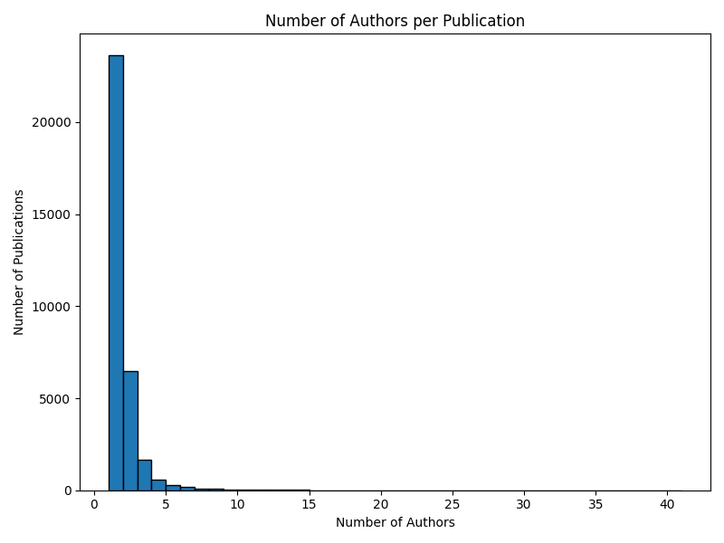
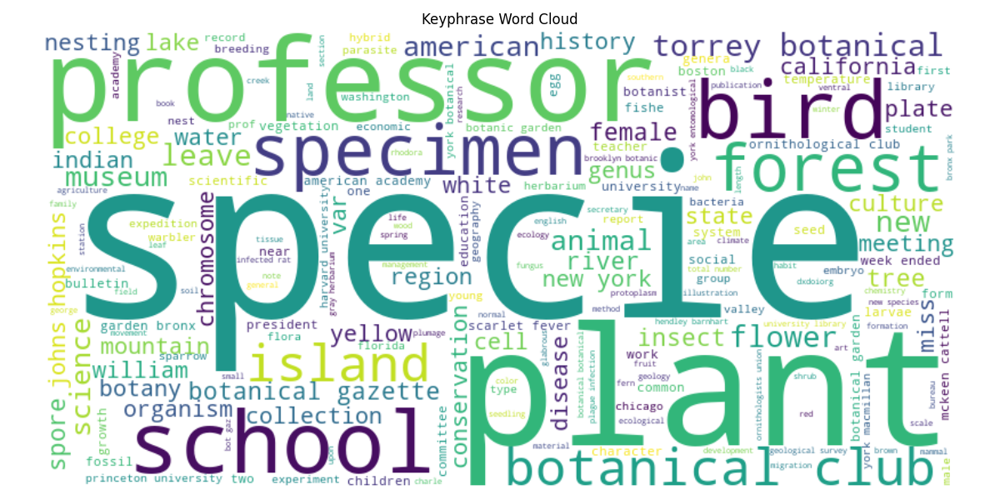
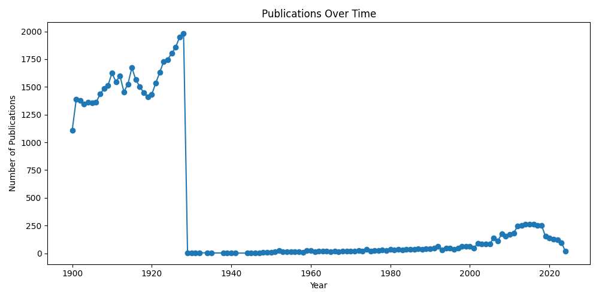

# Eco Data Mining - Data Discovery and Analysis Platform

## Project Overview

Eco Data Mining is an extensible and modular platform designed to automate the discovery, extraction, enrichment, and organization of ecological journal publications. Its primary aim is to bridge the gap between scientific literature and biological field stations by systematically mining research articles and linking them to verified field stations, research sites, and ecological observatories. The system supports both structured (relational) and semi-structured data processing workflows, making it suitable for ecological data scientists, researchers, and data engineers who require a scalable, research-grade solution.

---

## Objectives

- **Automate ingestion and processing** of ecological journal metadata.
- **Apply advanced NLP techniques** (NER, entity linking) to extract research locations and field station mentions from text.
- **Link extracted locations** to curated datasets such as OBFS and NEON field stations.
- **Build a hybrid relational database** integrating metadata, NLP-enriched content, and field station relationships.
- **Lay a foundation for advanced analysis** and visualization of ecological data.

---

## Project Architecture

```
eco-data-mining/
├── data/
│   ├── eco.db                    # SQLite database (excluded from Git)
│   ├── obfs_fieldstations.csv    # OBFS field station list
│   ├── neon_fieldstations.csv    # NEON field station list
│   └── raw/                      # Raw data files (JSONL, CSV, etc.)
├── db/
│   ├── models.py                 # SQLAlchemy ORM models
│   ├── engine.py                 # Database connection engine
│   └── connection.py             # DB connector with safe path handling
├── ml/
│   ├── preprocessing/
│   │   ├── extracting_fieldstationNLP.py  # NLP-based field station extractor
│   │   └── generate_ngrams.py            # N-gram extraction processor
│   └── models/                  # (Planned) custom NLP models
├── notebooks/
│   └── exploratory_analysis.ipynb        # Data exploration and validation
├── scripts/
│   ├── ingest_journals.py        # Journal ingestion
│   ├── verify_journals.py        # Data completeness verifier
│   ├── db_sanity_check.py        # Schema and integrity validator
│   └── update_journal_location.py# Linking journals to field stations
├── .gitignore
└── README.md
```

---

## Database Design (Hybrid 3-Tier Model)

| Tier    | Table           | Description                                                                 |
| ------- | -------------- | --------------------------------------------------------------------------- |
| Tier 1  | field_stations | Biological field station metadata (name, location, lat, lon, ecosystem)     |
| Tier 2  | journals       | Journal metadata (title, authors, publication date, keyphrases, full text)  |
| Tier 3  | journal_nlp    | NLP-enriched data: n-grams, entities, topics, embeddings (planned)          |

**Note:** The `journals` table includes a `meta_json` field for storing semi-structured data such as n-gram counts and extracted metadata.

---

## Technology Stack

- **Python 3.11+**
- **SQLite3** (via SQLAlchemy ORM)
- **spaCy 3.8+** (for NER and NLP pipelines)
- **pandas** (data handling and manipulation)
- **rapidfuzz** (fuzzy string matching)
- **Jupyter Notebooks** (exploratory data analysis)

---

## Installation Guide

### 1. Clone the Repository

```bash
git clone https://github.com/INFO-698-InfoSci-Capstone/eco-data-mining.git
cd eco-data-mining
```

### 2. Setup Virtual Environment and Install Dependencies

```bash
python -m venv venv
# On Windows:
.
env\Scripts ctivate
# On macOS/Linux:
source venv/bin/activate

pip install -r requirements.txt
python -m spacy download en_core_web_sm
```

---

## Workflow and Usage

**1. Ingest Journal Metadata**

```bash
python scripts/ingest_journals.py
```

**2. Extract Field Stations from Journal Full Text Using NLP**

```bash
python ml/preprocessing/extracting_fieldstationNLP.py
```

**3. Verify Data Completeness and Sanity**

```bash
python scripts/db_sanity_check.py
```

**4. Explore Data Using Jupyter Notebooks**

```bash
jupyter notebook notebooks/exploratory_analysis.ipynb
```

---

## Visualization and Exploratory Analysis

The project includes built-in visualizations to support analysis of publication metadata, NLP enrichment, and author collaboration patterns. These visualizations are generated using `matplotlib`, `seaborn`, and `wordcloud` and stored in `data/images/`.

### 1. Author Contribution Distribution

Displays a histogram of the number of authors per publication.



---

### 2. Keyphrase Word Cloud

Shows frequently used keyphrases across the journal dataset.



---

### 3. Location Word Cloud

Visualizes locations mentioned in the journal full text.


---

### 4. Publication Over Time

Plots number of publications by year.



---

### To Run Visualizations

```bash
python scripts/visualize_journals.py
```

---

## Data Handling and Best Practices

- The SQLite database (`eco.db`) is excluded from the repository (see `.gitignore`) and should be managed locally.
- Place `obfs_fieldstations.csv` and `neon_fieldstations.csv` in the `data/` directory.
- Store large data files in S3, Zenodo, or institutional repositories.

---

## Future Work and Enhancements

- Train domain-specific NLP models.
- Add topic modeling and embedding pipelines.
- Develop REST API for journal search and linking.
- Add Dash/Streamlit visual dashboards.
- Integrate biodiversity and climate data.

---

## Contributing

- Fork the repository.
- Create a feature branch.
- Commit changes and push to your fork.
- Open a pull request.

---

## License

Specify license here (MIT, Apache 2.0, etc.)

---

## Acknowledgments

- OBFS and NEON for field station data.
- spaCy, pandas, SQLAlchemy contributors.

---

## Contact

For questions or collaborations, contact the maintainers or open an issue.
